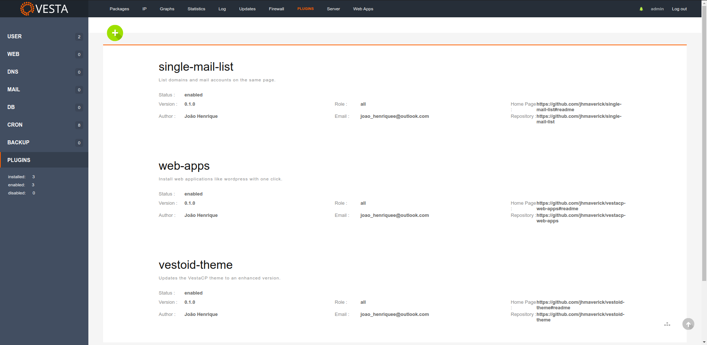

# VestaCP Plugin Manager

This script adds to vesta the ability to work with plugins.\
The plugins will be installed by Github repository or zip files.

Plugin manager features:
* Allows plugins to add executables to the Vesta bin directory.
* Change the VestaCP web files by adding actions and filters such as wordpress to allow plugins to interact.
  * The default menu will be hidden, and the menus will be added by the "header_menu" filter to allow plugins to add and edit items.
  * If the plugin "vestoid-theme" is installed, l-stats will be moved to the left and new options can be added with the "menu" filter.
  * Other actions will be added other points of the layout.
  * Adds the classes "Vesta" and "VestaPlugin" to assist plugins in their execution.
* Plugins can have hooks to run during their life cycle.




## Installation

#### Dependencies

* jq library
  * Debian: `sudo apt-get -y install jq`
  * CentOS: `sudo yum -y install jq`

```bash
curl -sL https://raw.githubusercontent.com/jhmaverick/vestacp-plugin-manager/master/install.sh | bash -
```


### Uninstall

Will remove changes in the VestaCP web files and delete files from plugin manager.

```bash
bash /usr/local/vesta/plugin-manager/uninstall.sh
```


### Reapply in VestaCP web files

Reconfigure vesta web if any updates remove plugin manager changes.

```bash
bash /usr/local/vesta/plugin-manager/reconfigure-vesta-web.sh
```


## Plugins structure

Plugins will be installed in /usr/local/vesta/plugins.

Plugin structure:
* **/vestacp.json** - Information about the plugin.
* **/bin/** - All files in this directory will be linked to vesta "/usr/local/vesta/bin".
* **/web/** - A symbolic link will be created to this directory with the plugin name inside "/usr/local/vesta/web/plugin/".
* **/web/functions.php** - Allows the plugin to perform actions before the layout is loaded.
* **/hook/** - Hooks to the plugin life cycle.

The only required file for the plugin is vestacp.json.\
If the plugin does not have a web interface it will not need the "web" directory, or if it does not have a CLI interface it will not need the "bin".


## Hooks for the plugin lifecycle

* **/hook/post_install** - Run after the plugin installation and before create the symlinks.
* **/hook/post_enable** - Run when plugin status change to enabled.
* **/hook/pre_disable** - Run when plugin status change to disabled.
* **/hook/pre_update** - Run before starting an update.
* **/hook/post_update** - Run after completing the update.
* **/hook/pre_uninstall** - Run after delete the symlinks and before delete plugin files.


## Actions, filters and functions

### Actions
* **init:** Loaded before display the "header.html".
* **head:** Loaded at the end of the head tag.
* **body_class:** Loaded in the body class attr.
* **panel_init:** Loaded in the admin/user panel after vesta get user information.
* **header_menu:** Loaded at the end of the header menu.
* **header_tray:** Loaded at the beginning of the "l-profile" tag.
* **menu:** Loaded at the end of the ".l-stats". Only displayed if "vestoid-theme" is installed.
* **pre_load_template:** Loaded before include template.
* **footer:** Loaded in the beginning of the "footer.html".
* **:**

### Filters
* **css:** List of css that will be inserted in the head tag.
* **js:** List of js that will be inserted in the head tag.
* **header_menu:** Items that will be inserted in the header by the action "header_menu".
* **menu:** Items that will be inserted in the "l-stats" tag by the action "menu".
* **body_class:** List of classes that will be called and treated "body_class" action.


### Functions

#### Vesta::render

Args:
* string $template HTML or full path to the template file.
* array $args 
  * string .plugin       - Plugin name to use as template directory.
  * string .tab          - Tab name to top_panel function. If not defined use global $TAB.
  * string .template_dir - Full path to directory. Default: /usr/local/vesta/web.
  * The rest of the arguments will be extracted

#### Vesta::render_cmd_output

Args:
* string $output
* string $title
* string $backbutton

#### Vesta::exec

Args:
* string $cmd
* ... $args

#### Vesta::add_filter

Args:
* string $tag
* callable $callback
* int $priority

#### Vesta::apply_filters

Args:
* string $tag
* ... $init_value

#### Vesta::add_action

Args:
* string $tag
* callable $callback
* int $priority

#### Vesta::do_action

Args:
* string $tag
* ... $args

#### Vesta::add_css

Args:
* string $link
* int $priority

#### Vesta::add_js

Args:
* string $link
* int $priority

#### Vesta::add_header_menu

Args:
* string $name
* string $link
* string $page_tab
* string $local
* int $priority

#### Vesta::add_menu

Args:
* string $name
* string $link
* string $page_tab
* array $sub_items
  * string [].name
  * string [].value
  * string [].link
* string $local
* int $priority

#### Vesta::current_panel
Return: user_panel|admin_panel|external

#### Vesta::get_plugins

#### Vesta::get_plugin
Args:
* string $plugin_name


## vestacp.json

```json5
{
  "name": "plugin-name",
  "description": "Plugin description",
  "version": "0.0.1",
  "min-vesta": "0.9.8",
  "repository": "https://github.com/jhmaverick/plugin-name",
  "homepage": "https://github.com/jhmaverick/plugin-name#readme",
  "author": {
    "name": "João Henrique",
    "email": "joao_henriquee@outlook.com",
    "homepage": "https://github.com/jhmaverick/"
  }
}
```

* **name:** The plugin name. Will be used in the plugin directory and the plugin identification. Only include lowercase alphanumeric, dashes, and underscores characters.
* **repository:** The plugin repository. Used to download updates in `v-update-plugin`.
* **min-vesta:** Minimum vesta version.

